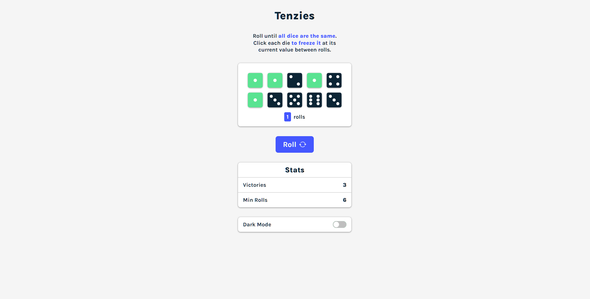
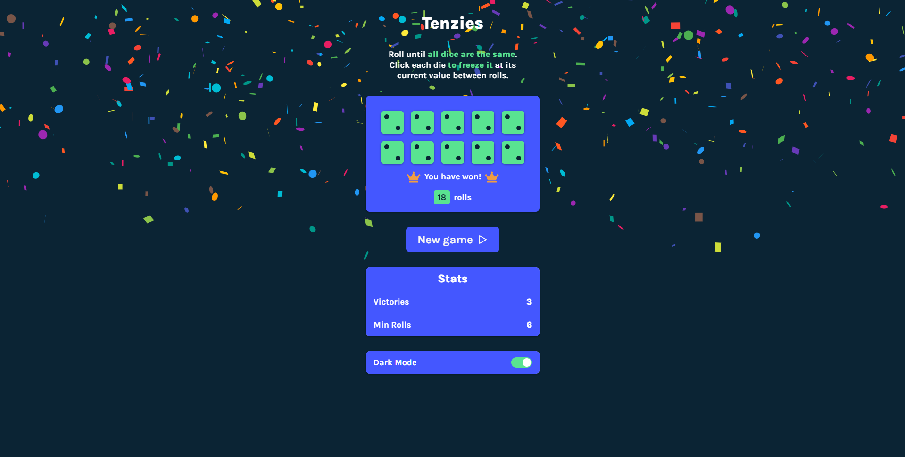
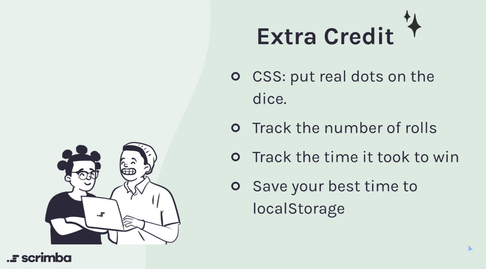

<h1 align="center">Tenzies</h1>
<p align="center">
  Made with <code>HTML</code>, <code>CSS</code>, <code>TypeScript</code>, <code>ReactJS</code>, <code>styled-components</code>
  <br>
  Bundled with <code>Vite</code>
</p>

<p align="center">
  <a href="../../commits"></a>
  <a href="./LICENSE"></a>
  
</p>

<p align="center">
  <a href="#-screenshots">🖼 Screenshots</a> • 
  <a href="#ℹ%EF%B8%8F-about">ℹ️ About</a> • 
  <a href="#%EF%B8%8F-tools">⚙️ Tools</a> • 
  <a href="#-build-project">🔨 How to Build Project</a> • 
  <a href="#-file-structure">📁 File Structure</a>
</p>

<sup>
  <p align="center">
    <a href="#-npm-packages-worth-mentioning">📦 NPM Packages worth mentioning</a> • 
    <a href="#-details">💡 Details</a> • 
    <a href="#-useful-resources">🔗 Useful resources</a> • 
    <a href="#-author">👤 Author</a>
  </p>
</sup>

## 🖼 Screenshots

<p align="center">
  
</p>

<p align="center">
  
</p>

## ℹ️ About

This is a modification of a challenge "Tenzies" from Scrimba React Course ([link](https://scrimba.com/learn/learnreact/tenzies-project-intro-cof0d44bfad1fb88293fdc9d1)).

The challenge is to modify Tenzies application logic and add some new features.

<p align="center">
  
</p>

I made my own Figma prototype and redesigned the whole application, added a dark theme.

Figma prototype: https://www.figma.com/file/0HbMUVtybRaI1SFtDlcRzq/Tenzies

## ⚙️ Tools

- **HTML5**
  - ReactJS
- **CSS**
  - styled-components
- **TypeScript**
  - ReactJS
- **NodeJS**
- **Vite**
- **Github Pages**

## 🔨 Build project

<table>
  <tr>
    <th>Command</th>
    <th>Description</th>
  </tr>
  <tr>
    <td><code>npm&nbsp;install</code></td>
    <td>Installs required npm packages. Run it before building the project</td>
  </tr>
  <tr>
    <td><code>npm&nbsp;run&nbsp;dev</code></td>
    <td>Starts a local web server with HMR (Hot Module Replacement) for development</td>
  </tr>
  <tr>
    <td><code>npm&nbsp;run&nbsp;build</code></td>
    <td>Builds the project, and outputs to the folder <code>./build</code></td>
  </tr>
  <tr>
    <td><code>npm&nbsp;run&nbsp;preview</code></td>
    <td>Start a local web server that serves the built solution from <code>./build</code> for previewing</td>
  </tr>
</table>

## 📁 File Structure

```Markdown
├── 📁 build                  Files of the built solution
|
├── 📁 docs                   Additional information, documentation 
│   └── 📁 results            Screenshots of how the application works after being fully developed
|
├── 📁 src                            Source files needed for application development
│   ├── 📁 assets                     Static assets: images, icons, favicons
│   ├── 📁 components                 React components
|   |   └── 📁 Component Name
|   |       ├── 📝 index.tsx          Component logic
|   |       ├── 📝 index.styled.tsx   Component styles
|   |       └── 📝 index.types.tsx    Component types (optional)
│   ├── 📁 hooks                      Custom React hooks
│   ├── 📁 styles                     Global styles
│   ├── 📁 utils                      Utility functions
│   ├── 📝 App.styled.tsx             App styles
│   ├── 📝 App.tsx                    App React component
│   ├── 📝 App.types.tsx              App types
│   ├── 📝 index.html                 Main html file
│   ├── 📝 index.tsx                  Entry point for the module bundler
│   ├── 📝 styles.css                 Styles for the loader displayed until JS is loaded
│   └── 📝 vite-env.d.ts              Type definitions for environment variables (Vite)
|
├── 📝 .gitignore             Instructions for Git about what files to ignore
├── 📝 LICENSE                MIT License. Basically you can do whatever you want with the code
├── 📝 README.md              Project description
├── 📝 package-lock.json      Keeps track of the exact version of every package that is installed
├── 📝 package.json           Various metadata relevant to the project, scripts, dependencies
├── 📝 tsconfig.json          TypeScript configuration file
├── 📝 tsconfig.node.json     TypeScript configuration file for Vite
└── 📝 vite.config.ts         Vite configuration file
```

## 📦 NPM Packages worth mentioning

<table>
  <tr>
    <td><code>nanoid</code></td>
    <td>Generates unique ids. Used it to uniquely lavel dices</td>
  </tr>
  <tr>
    <td><code>react-confetti</code></td>
    <td>Shows confetti on a screen. Used it to show nice confetti when a user wins a game</td>
  </tr>
</table>

## 💡 Details

My first ReactJS project with TS!

- Dark Mode / Light Mode
- Save chosen mode, number of victories, state of the game, stats in local storage
- Calculate total number of victories, minimal number of rolls needed to win the game
- Used custom hooks to make the code look cleaner. They help to incapsulate initial definition of the state from local storage, laucnh useEffect that saves modified data in local storage
- Added a spinner that shows until all JS resources are downloaded

## 🔗 Useful resources

- [ReactJS Course](https://scrimba.com/learn/learnreact/) - Awesome free interactive course!
- [StackOverflow : Guide on a spinner](https://stackoverflow.com/questions/40987309/react-display-loading-screen-while-dom-is-rendering)
- [W3Schools : Custom toggle switch](https://www.w3schools.com/howto/howto_css_switch.asp)
- [Implementing Dark Mode In React Apps Using styled-components — Smashing Magazine](https://www.smashingmagazine.com/2020/04/dark-mode-react-apps-styled-components/) - Tried to use it, it didn't work, although it motivated me to use custom hooks, so eventually I came up with my own solution that worked fine
- [Vite docs](https://vitejs.dev/)

## 👤 Author

- Frontend Mentor - [@GrbnvAlex](https://www.frontendmentor.io/profile/GrbnvAlex)
- Telegram - [@Arlagonix](https://t.me/Arlagonix)
- Github - [@arlagonix](https://github.com/arlagonix)
